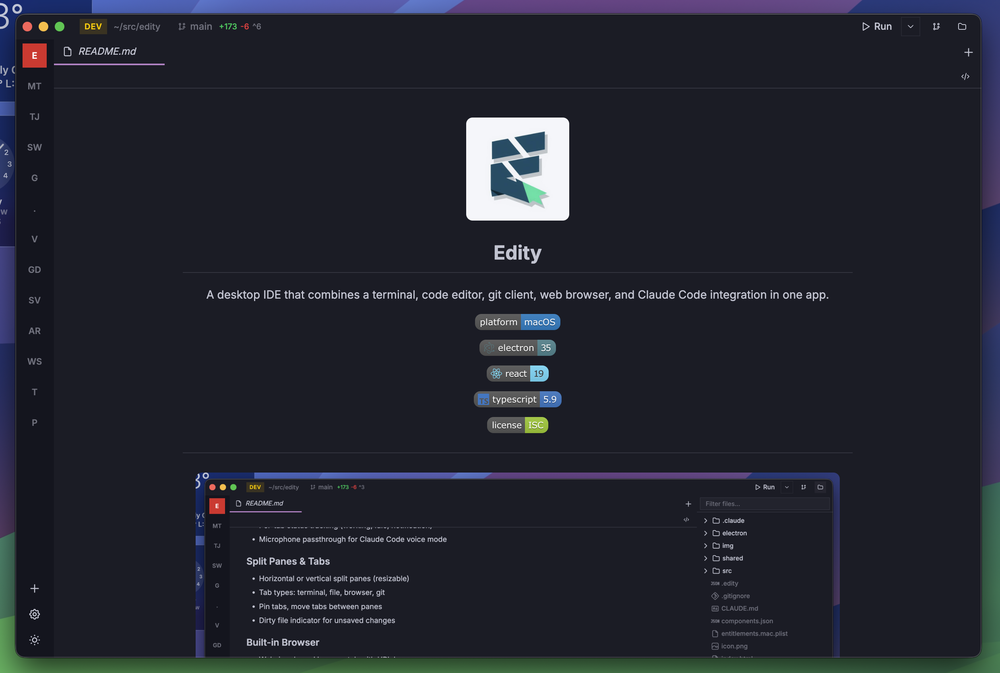
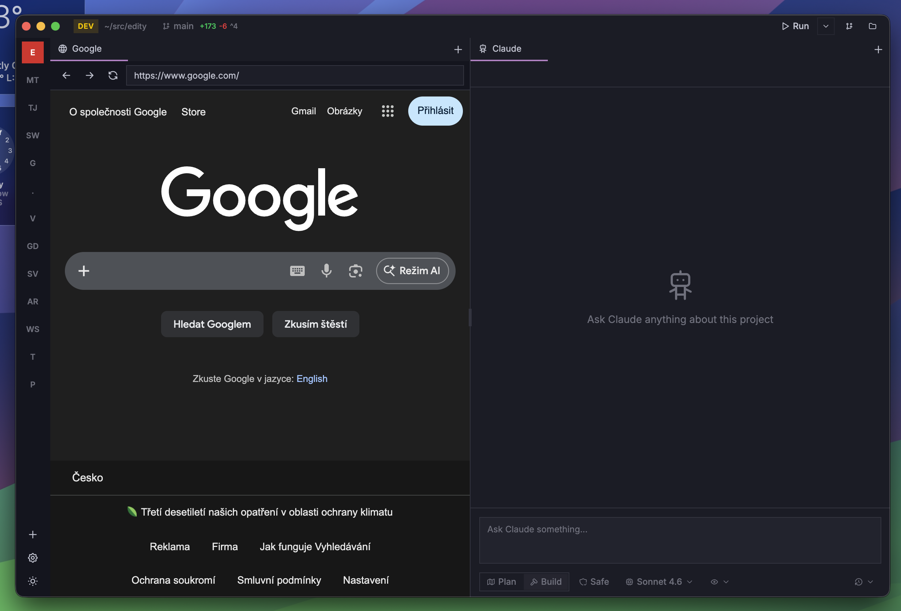
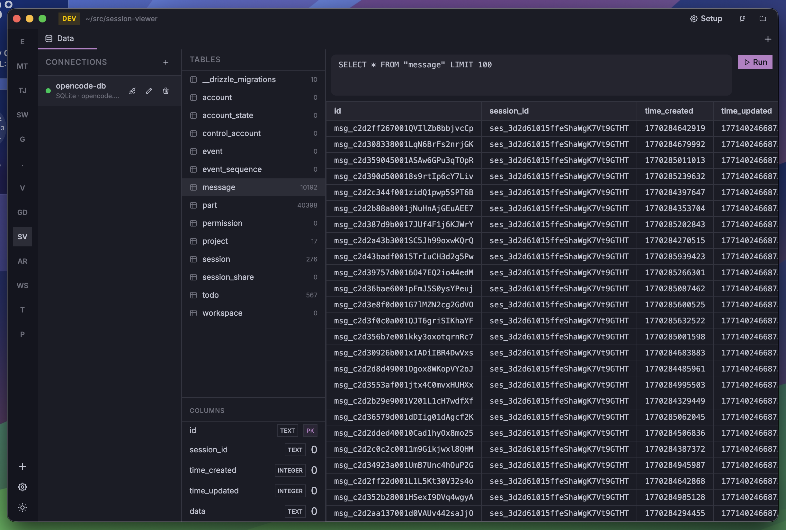
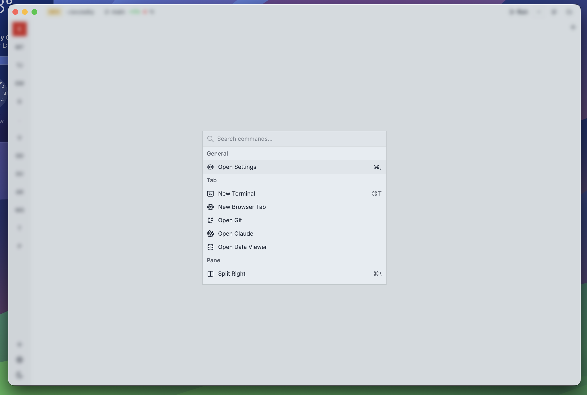

<p align="center">
  
</p>

<h1 align="center">Edity</h1>

<p align="center">
  A desktop IDE that combines a terminal, code editor, git client, web browser, database explorer, and Claude Code integration in one app.
</p>

<p align="center">
  
  
  
  
  
</p>

---

<p align="center">
  
</p>

<p align="center">
  
  
  
</p>

---

## Features

### Multi-Project Workspace

- Work on multiple projects simultaneously with fully isolated state per project
- Each project gets its own tabs, terminals, file tree, and git context
- Custom project colors and two-character acronyms for quick identification
- Drag-and-drop reorder of projects in the sidebar
- Per-project configuration stored in a `.edity` file at the project root
- Quick project switching with keyboard shortcuts (`Mod+{` / `Mod+}`)

### Terminal

- Full terminal emulator powered by xterm.js and node-pty
- Multiple terminal tabs per project
- Foreground process detection with dynamic tab titles
- Light/dark theme sync with ANSI color support
- Automatic shell detection (bash, zsh, fish)
- Initial command support on terminal startup

### Code Editor

- Monaco Editor with TypeScript/JavaScript IntelliSense
- Automatic `tsconfig.json` / `jsconfig.json` detection
- Type definitions loaded from `node_modules` and `@types` for autocomplete
- Syntax highlighting for 170+ languages via Shiki
- Dirty file indicator for unsaved changes
- External file change detection with automatic reload
- Custom light and dark editor themes

### Markdown Preview

- Live preview with GitHub Flavored Markdown support
- Edit/preview toggle with `Cmd+Shift+V`
- Shiki syntax-highlighted code blocks
- Raw HTML rendering support
- Relative image resolution from file path

### Image Viewer

- Built-in image display with file size information
- Supports common formats (PNG, JPG, SVG, etc.)

### File Explorer

- Recursive directory browsing with folders-first sorting
- Git-aware file status indicators (Modified, Added, Deleted, Untracked)
- Filter by git status to show only changed files
- Show/hide git-ignored files
- Context menu: create, rename, delete files and folders, copy path, reveal in Finder
- Inline rename and create editing
- Automatic `.git` directory exclusion

### Git Client

- **Changes** — stage, unstage, and discard files with status indicators
- **Commits** — write commit messages and commit staged changes
- **History** — scrollable log with pagination and commit detail view
- **Diff viewer** — unified diffs with syntax highlighting, binary detection, new/deleted file markers
- **Branches** — create, switch, delete branches; view remote tracking info
- **Push / Pull / Fetch** — one-click operations with ahead/behind indicators in the top bar
- **Diff statistics** — additions, deletions, and changed file counts displayed in the top bar

### Claude Code Integration

- Full SDK integration via `@anthropic-ai/claude-agent-sdk`
- Session management — start new sessions, resume existing ones, list history
- Real-time message streaming with batch buffering
- Tool execution UI with approval/denial prompts
- Permission modes: default, acceptEdits, bypassPermissions, plan, dontAsk
- AskUserQuestion tool for interactive user input
- Model selection between Claude models
- Session interruption support
- Automatic detection of Claude Code sessions in the terminal via OSC escape sequences
- Installs hooks into `~/.claude/settings.json` on startup
- Per-tab status tracking (working, idle, notification)
- Configurable chat avatars and auto-expand tool list

### Data Browser

- **Redis** — key scanning with pattern support, pagination, value display for all key types (string, list, set, zset, hash, stream), TTL display, key deletion, TLS and password auth support, database selection
- **SQLite** — list tables and views, view schema, execute arbitrary SQL queries with parameterized support, result display in table format
- Save, edit, and delete connections per project
- Test connection before saving
- Connection status indicators (connected, connecting, error, disconnected)

### Run Commands

- Automatic script detection from `package.json`, `Cargo.toml`, `Makefile`, and `pyproject.toml`
- Run in terminal tab or background mode
- Run/stop toggle with dropdown for multiple commands
- Per-project process management with running process counter
- Kill individual processes or all project processes at once

### Split Panes & Tabs

- Horizontal split (`Mod+\`) or vertical split (`Mod+Shift+\`)
- Resizable panes with focus switching (`Mod+Shift+F`)
- Tab types: terminal, file, browser, git, claude, data
- Pin tabs, move tabs between panes
- Dirty file indicator for unsaved changes

### Built-in Browser

- Webview-based browser tab with URL bar
- Back / forward / reload navigation
- DevTools support
- URL copy to clipboard
- Tab title synced with page title

### Command Palette

- Searchable command list with `Mod+P`
- Commands grouped by category (general, tab, pane, view, project, run)
- Keybinding hints displayed alongside commands
- Execute on selection

### Themes

- 20+ built-in themes with light and dark variants
- **Light**: Edity Light, Catppuccin Latte, Rose Pine Dawn, Tokyo Night, Gruvbox Light, Solarized Light, GitHub Light
- **Dark**: Edity Dark, Catppuccin Frappe/Macchiato/Mocha, Rose Pine/Moon, Tokyo Night Storm, Dracula, Nord, Gruvbox Dark, One Dark Pro, Solarized Dark, GitHub Dark
- Theme applies to UI, editor, terminal colors, and syntax highlighting
- Toggle light/dark mode with `Mod+/`

### Keyboard Shortcuts

All shortcuts are customizable via Settings (`Mod+,`):

| Shortcut | Action |
|----------|--------|
| `Mod+P` | Command palette |
| `Mod+,` | Settings |
| `Mod+T` | New terminal |
| `Mod+W` | Close tab |
| `Ctrl+Tab` / `Ctrl+Shift+Tab` | Next / previous tab |
| `Mod+\` | Split right |
| `Mod+Shift+\` | Split down |
| `Mod+Shift+F` | Focus other pane |
| `Mod+B` | Toggle file sidebar |
| `Mod+Shift+G` | Toggle git sidebar |
| `Mod+{` / `Mod+}` | Previous / next project |
| `Mod+Shift+R` | Run project |
| `Mod+/` | Toggle light/dark mode |
| `Cmd+Shift+V` | Toggle markdown preview |

### Settings

- Theme selector with visual swatches for light and dark themes
- Keybindings editor with add, remove, and reset to defaults
- Claude integration settings (chat avatars, auto-expand tools)

## Tech Stack

| Layer | Technology |
|-------|-----------|
| Framework | Electron 35 |
| Frontend | React 19, TypeScript 5.9, Vite 8 |
| Styling | Tailwind CSS 4, shadcn/ui (Radix UI) |
| Editor | Monaco Editor, Shiki |
| Terminal | xterm.js, node-pty |
| AI | @anthropic-ai/claude-agent-sdk |
| Icons | Tabler Icons |
| Optimization | React Compiler (babel plugin) |

## Getting Started

### Prerequisites

- Node.js 20+
- npm

### Install

```bash
git clone https://github.com/your-username/edity.git
cd edity
npm install
npm run rebuild   # rebuild native modules (node-pty) for Electron
```

### Development

```bash
npm run dev
```

Starts the Vite dev server on port 1420 and launches Electron with hot reload.

### Build & Package

```bash
npm run build      # compile TypeScript + bundle with Vite
npm run package    # build + create .dmg for macOS
```

The packaged app will be in the `release/` directory.

## Project Structure

```
edity/
├── electron/
│   ├── main.js          # Electron main process + IPC handlers
│   ├── preload.js       # Context bridge (window.electronAPI)
│   └── claude-hook.sh   # Claude Code status hook script
├── src/
│   ├── components/
│   │   ├── layout/      # Sidebar, TopBar, FileTree, TabBar, MainContent
│   │   ├── git/         # GitView, Changes, Commit, Log, Branches, Diff
│   │   ├── claude/      # Claude session UI, message bubbles, tool bodies
│   │   ├── viewer/      # MonacoEditor, MarkdownViewer, ImageViewer
│   │   ├── data/        # DataBrowser, Redis and SQLite viewers
│   │   └── ui/          # shadcn/ui components
│   ├── contexts/        # AppContext (global state)
│   ├── hooks/           # useTabManager, useGitState, useFileContent, etc.
│   ├── lib/             # IPC wrapper, git-graph, diff-parser, shiki, themes, utils
│   └── types/           # TypeScript type definitions
├── icon.png
├── package.json
└── CLAUDE.md
```

## Data Storage

All persistent data is stored in `~/.config/edity/`:

| File | Purpose |
|------|---------|
| `projects.json` | List of registered projects |
| `settings.json` | Global settings (themes, keybindings) |
| `claude-status/` | Per-session Claude Code status files |
| `claude-hook.sh` | Hook script for Claude integration |

Per-project configuration is stored in `.edity` at each project's root.

## License

All rights reserved to Jakub Indrák
